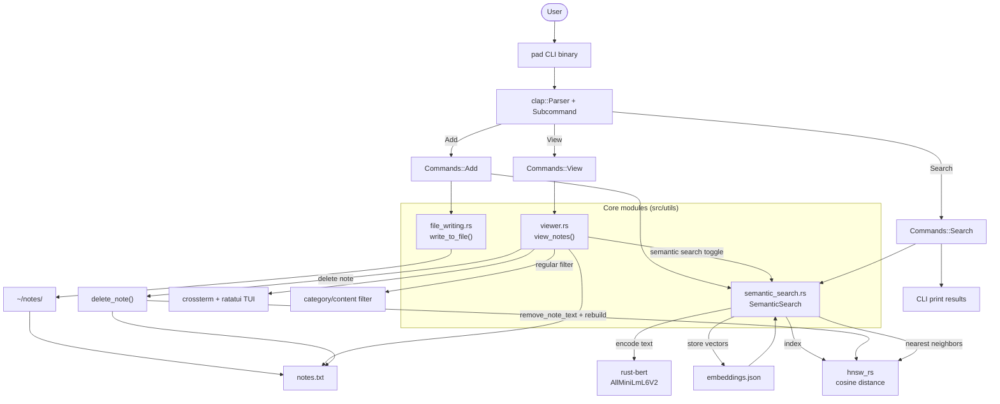

# Legal Pad

A simple, command-line notepad application for quick thoughts and notes.

## Overview

This project was inspired by Andrej Karpathy's "append-and-review" note structure. After reading his blog on this
note-taking framework, I realized that I had several different notetaking mediums (Notion, Google Keep, Apple Notes,
etc.), causing my notes to be spread across a range of platforms. Because of this, I rarely ever went back to look at 
these notes; this is why I need a consolidated platform. Becuase I've been utilizing the command line so often lately, I 
decided to make a CLI app written in Rust for performance.  

## System Design



## Features

- Add notes with different categories (read, watch, listen, idea, general)
- View all your notes
- Simple and intuitive command-line interface
- Global access from any directory

## Installation

1. Clone this repository:
```bash
git clone https://github.com/yourusername/legal-pad.git
cd legal-pad
```

2. Build the project:
```bash
cargo build --release
```

3. Install globally:
```bash
# For Linux/macOS
sudo cp target/release/pad /usr/local/bin/

# For Windows (PowerShell as Administrator)
# Copy target/release/pad.exe to a directory in your PATH
```

## Usage

### Adding Notes

Add a note with optional category flags:
```bash
# General note
pad add "Your note text here"

# Category-specific notes
pad add -r "Article to read later"  # Read category
pad add -w "Movie to watch"         # Watch category
pad add -l "Podcast to listen to"   # Listen category
pad add -i "Project idea"           # Idea category
```

### Viewing Notes

View all your notes:
```bash
pad view
```

## Notes Storage

Notes are stored in the `notes` directory in your home folder:
- Linux/macOS: `~/notes/`
- Windows: `%USERPROFILE%\notes\`

## Requirements

- Rust (latest stable version)
- Cargo (comes with Rust)
